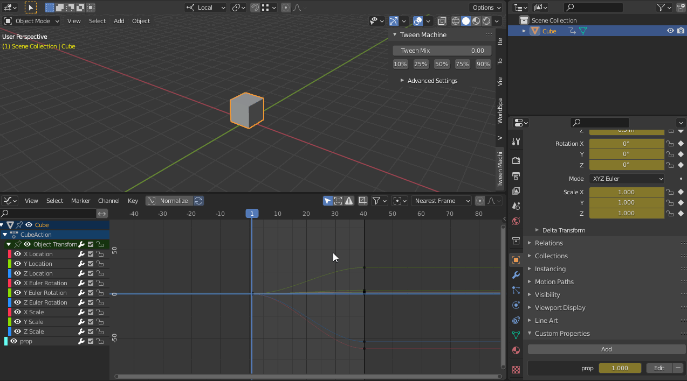
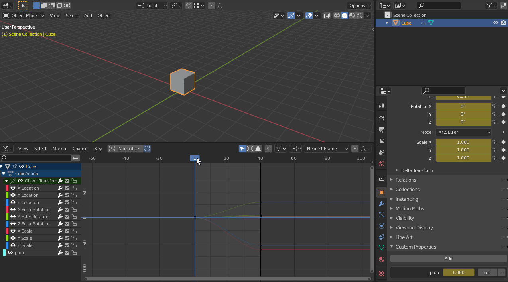
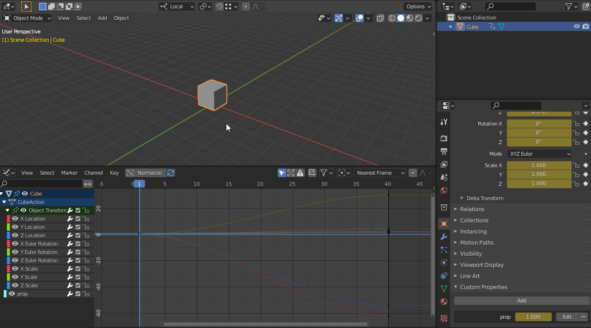

# blender-tweenMachine
 Create break down poses in Blender,
 inspired by the original tweenMachine 
 from [Justin Barrett](http://www.justinsbarrett.com/) in Maya. 

# Features

# Usage
## Panel

## Menu

## Search operator (F3)

# Installation

### First Method : Clone the repository
1. Open a  command terminal
2. Change directory to the add-ons folder in your blender user preferences folder : 
   <BLENDER_PREFERENCES_FOLDER> > scripts > addons
3. Clone the repository with git command.
6. Open Blender
7. Go to Edit > Preference > Add-ons and enable "Tween Machine" add-ons

### Second Method : Download the addon and install it
1. Download the repository(.zip)
2. In Blender Go to the preference window (Edit > Preferences)
3. Click on Addon in the left panel
4. Click on install... on the top right
5. Browse and select the zip file previously download
   and click on the button "Install Add-ons" on the bottom    
6. Close and re-open Blender
7. Go to Edit > Preference > Add-ons and enable "Tween Machine" add-ons
